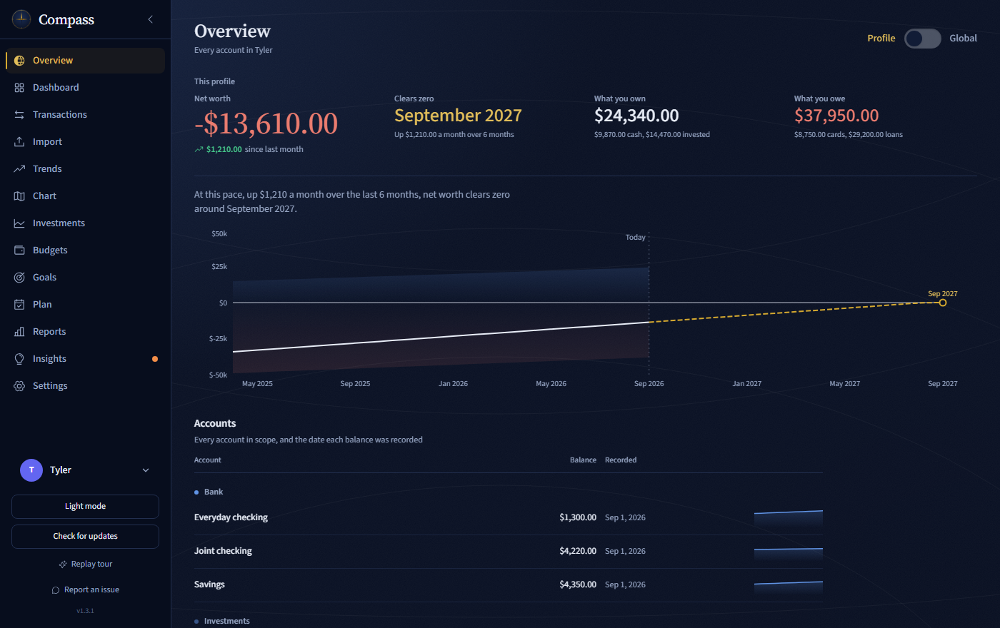

<p align="center">
  
</p>

<h1 align="center">Compass</h1>

<p align="center"><b>Personal finance that never leaves your computer.</b></p>

<p align="center">
  <a href="https://github.com/tylahfam97/Compass/releases/latest"></a>
  <a href="https://github.com/tylahfam97/Compass/actions/workflows/playwright.yml"></a>
  <a href="LICENSE.txt"></a>
  
</p>

<p align="center">
  <a href="https://github.com/tylahfam97/Compass/releases/latest">Download</a> ·
  <a href="https://privatecompass.app">Website</a> ·
  <a href="RELEASE_NOTES.md">Release notes</a> ·
  <a href="https://github.com/tylahfam97/Compass/issues">Report an issue</a>
</p>

<p align="center">
  
</p>

Export a CSV from your bank, drop it in, and see where your money actually goes. No bank login, no
subscription, no cloud account, and nothing to sign up for. Your statements are read on your machine
and stored in an encrypted database that only you can open.

## Why Compass

- **No bank credentials, ever.** Compass imports the files your bank already gives you. It never asks
  for a login and has no way to reach your accounts.
- **Encrypted and local.** Everything lives in a SQLCipher (AES-256) database on your own disk.
- **No telemetry.** No analytics, no cloud sync, no account. The only network calls are update checks
  against GitHub, which never upload your data.
- **Free and open source.** MIT licensed, so you can read exactly what it does with your money.

## What you get

| Workspace | What it answers |
|---|---|
| **Overview** | Where you stand across every account. Net worth is drawn as depth above and below a zero waterline, and when you are below it, the pace you have actually been climbing at projects the month you clear zero. |
| **Dashboard** | How this month is going: income, spending, what is still due, and how this pay cycle compares with your own usual pace. |
| **Chart** | Where a month's money went, drawn as currents from paychecks through accounts out to bills, categories, cards, savings and debt, with a day-by-day scrubber. |
| **Transactions** | Search, filter, edit and categorise; make bulk changes or export the filtered view as CSV. |
| **Trends & Reports** | Compare periods, and examine category, merchant and recurring spending. |
| **Budgets & Goals** | Weekly or monthly limits with optional rollover, and savings, spending, balance or debt targets. |
| **Plan** | Forecast spendable cash to your next paycheck, with safe-to-spend, projected lowest balance, and Avalanche, Snowball or Cash-flow First payoff comparisons. |
| **Insights** | Health scores, a fixed-versus-flexible view of an average month, what your money cost or earned in interest, and action items ordered by the money at stake. |
| **Investments** | Dated portfolio snapshots, allocation, holdings, and income and gains. |

Light and dark themes, keyboard navigation and reduced motion throughout. Profiles keep separate
financial histories, and Global views combine the ones you unlock.

## Get started

1. Install from the [latest release](https://github.com/tylahfam97/Compass/releases/latest).
2. Try **Demo Mode** to explore with sample data, or create a profile for your own finances.
3. Export transactions from your bank, open **Import**, and check the detected columns in the preview.
4. Review your categories, then add upcoming bills and income in **Plan**.

Compass works offline after installation. Import another statement whenever you want to bring your
data up to date.

| Platform | Download | Requirements |
|---|---|---|
| Windows | `.exe` installer or `.msi` package | Windows 10/11 64-bit. WebView2 is installed if missing. |
| macOS (beta) | Universal `.dmg` | macOS 10.15+, Intel or Apple Silicon |

Unsigned macOS builds may need approval in **System Settings > Privacy & Security** after the first
launch attempt. Only approve a download you trust from the official release page.

### What imports

- **Banks and credit cards:** CSV and spreadsheet files, with guided column mapping, a preview,
  saved layouts for repeat imports, and duplicate detection. Batch import handles multiple files.
- **Investments:** Wells Fargo Advisors, Fidelity and Thrivent exports; Principal 401(k) and
  E\*TRADE / Morgan Stanley PDF statements. Support varies by institution and statement type.
- **Loans:** supported loan statements, or enter the rate and minimum payment yourself.
- **Categorisation:** built-in rules plus your own, with a live preview showing what each rule
  matches before you save it.

Transfers and the **Excluded** category never count as income or expenses, and credit card payments
are treated as transfers so they are not counted twice.

## Your data

Compass stores an encrypted SQLite database through **SQLCipher (AES-256)**. The Rust backend keeps
the key in Windows Credential Manager or the macOS Keychain, with a key file in the app data
directory as a fallback.

| Platform | App data directory |
|---|---|
| Windows | `%APPDATA%\com.compass.app\` |
| macOS | `~/Library/Application Support/com.compass.app/` |

That directory holds `compass.db` and `compass.key`. **The key file unlocks the database, so protect
both files and any backup of them.** Encryption at rest is not a substitute for securing your device.

- **Full backup:** **Settings > Backup & Restore > Export Backup** writes a `.compassbackup` file.
  It contains the database and its key, so treat it as sensitive.
- **Restore:** **Restore Backup** validates the file and relaunches to finish.
- **CSV export:** in Transactions, select **All time**, clear filters and export. Repeat per profile.
- **Erase:** **Settings > Erase this profile's data** permanently removes one profile's data after a
  typed confirmation. Uninstalling does not erase anything; remove the app data directory yourself.

## Current limits

Worth knowing before you install:

- Windows and macOS (beta) only. There is no mobile app and no supported Linux release.
- No live bank connections, cloud sync or shared access.
- Single currency, with no conversion.
- Bank imports do not support OFX, QIF or arbitrary PDF statements.
- Scheduled bills and income feed forecasts but never create real transactions.
- Cash-flow forecasts cover checking and debit accounts, not projected credit card balances.
- Forecasts need at least two months of history, and every figure depends on the statements you
  have imported. Verify anything important against your bank.

Compass is not financial advice.

## Development

Built with **Tauri 2, React 19, TypeScript, Rust and SQLite**, using Vite, Tailwind CSS, Zustand and
Recharts. Financial logic lives in pure, unit-tested modules under `src/lib/`.

Requires [Node.js 24+](https://nodejs.org/), [Rust](https://rustup.rs/) stable, and the
[Tauri prerequisites](https://v2.tauri.app/start/prerequisites/) for your platform.

```sh
git clone https://github.com/tylahfam97/Compass.git
cd Compass
npm ci
npm run tauri dev     # the real desktop app; `npm run dev` is frontend only
```

```sh
npm test              # unit tests
npm run build         # type-check and build the frontend
npx playwright install chromium && npm run test:e2e
npm run tauri build   # installers, written to src-tauri/target/release/bundle/
```

## Contributing

See [CONTRIBUTING.md](CONTRIBUTING.md) and the [Code of Conduct](CODE_OF_CONDUCT.md).
[Open an issue](https://github.com/tylahfam97/Compass/issues) with your Compass version, OS, steps to
reproduce and what you expected.

For import problems, include the institution, the file type and the step that failed. A header row
and a few rows of **invented data** are enough. Never attach real statements, account numbers,
databases, keys or backups.

## License

[MIT](LICENSE.txt).
